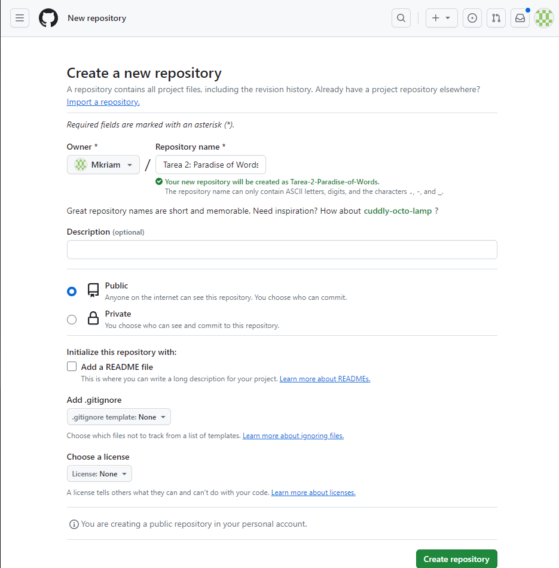

# Tarea 2
## Identificación
* Míriam Rodríguez Antequera
* Módulo: LMSGI
* Instituto: IES Aguadulce
* Curso: 1º DAW

## Uso de Git mediante la terminal git bash
* Creación del repositorio en nuestro ordenador (init):
```
maniana@DAMDAW1-XX MINGW64 ~/Dropbox/LM/Tarea2
$ git init
Initialized empty Git repository in C:/Users/maniana/Dropbox/LM/Tarea2/.git/
```
* Creación de un commit inicial (add, status, commit, log):

```
maniana@DAMDAW1-XX MINGW64 ~/Dropbox/LM/Tarea2 (master)
$ git add .

maniana@DAMDAW1-XX MINGW64 ~/Dropbox/LM/Tarea2 (master)
$ git status
On branch master

No commits yet

Changes to be committed:
  (use "git rm --cached <file>..." to unstage)
        new file:   README.md
        new file:   index.html
        new file:   style.css


maniana@DAMDAW1-XX MINGW64 ~/Dropbox/LM/Tarea2 (master)
$ git commit -m "añado README, index y style"
[master (root-commit) cbf91b3] añado README, index y style
 3 files changed, 35 insertions(+)
 create mode 100644 README.md
 create mode 100644 index.html
 create mode 100644 style.css

maniana@DAMDAW1-XX MINGW64 ~/Dropbox/LM/Tarea2 (master)
$ git log
commit cbf91b3ebadcc5480641c2b9954f122f3227a5dd (HEAD -> master)
Author: Miriam <miriam@daw.com>
Date:   Mon Jan 15 08:46:50 2024 +0100

    añado README, index y style

```
* Creación del repositorio en Github:
```

```
* Añadir el remoto al repositorio local (branch, remote),
* Subir el repositorio a Github (push) y
* Comprobar que está subido a Github.
