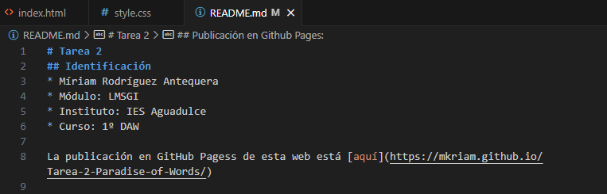

# Tarea 2
## Identificación
* Míriam Rodríguez Antequera
* Módulo: LMSGI
* Instituto: IES Aguadulce
* Curso: 1º DAW

La publicación en GitHub Pagess de esta web está [aquí](https://mkriam.github.io/Tarea-2-Paradise-of-Words/)


## Uso de Git mediante la terminal git bash
* Creamos el repositorio en nuestro ordenador mediante git bash con el comando ``git init``:
```
maniana@DAMDAW1-XX MINGW64 ~/Dropbox/LM/Tarea2
$ git init
Initialized empty Git repository in C:/Users/maniana/Dropbox/LM/Tarea2/.git/
```
* Se crea un commit inicial usando el comando ``git`` junto a las sentencias ``add``, ``status``, ``commit`` y ``log``:

```
maniana@DAMDAW1-XX MINGW64 ~/Dropbox/LM/Tarea2 (master)
$ git add .

maniana@DAMDAW1-XX MINGW64 ~/Dropbox/LM/Tarea2 (master)
$ git status
On branch master

No commits yet

Changes to be committed:
  (use "git rm --cached <file>..." to unstage)
        new file:   README.md
        new file:   index.html
        new file:   style.css


maniana@DAMDAW1-XX MINGW64 ~/Dropbox/LM/Tarea2 (master)
$ git commit -m "añado README, index y style"
[master (root-commit) cbf91b3] añado README, index y style
 3 files changed, 35 insertions(+)
 create mode 100644 README.md
 create mode 100644 index.html
 create mode 100644 style.css

maniana@DAMDAW1-XX MINGW64 ~/Dropbox/LM/Tarea2 (master)
$ git log
commit cbf91b3ebadcc5480641c2b9954f122f3227a5dd (HEAD -> master)
Author: Miriam <miriam@daw.com>
Date:   Mon Jan 15 08:46:50 2024 +0100

    añado README, index y style

```
* Creamos el repositorio en Github:


Este repositorio se establece como público para mas adelante poder visualizar correctamente la página web mediante GitHub Pages.

*  Añade al usuario del profesor *jmoba* como colaborador de ese repositorio:


Mediante el apartado de ajustes de nuestro repositorio en la pestaña colaboradores podemos enviar invitaciones a otros usuarios concediendoles los permisos necesarios para que puedan 

* Añadiremos el remoto al repositorio local con los comandos ``git branch`` y ``git remote`` :
```
maniana@DAMDAW1-XX MINGW64 ~/Dropbox/LM/Tarea2 (master)
$ git branch
* master

maniana@DAMDAW1-XX MINGW64 ~/Dropbox/LM/Tarea2 (master)
$ git remote add origin https://github.com/Mkriam/Tarea-2-Paradise-of-Words.git
```
* Subimos el repositorio a Github mediante el comando ``git push origin master`` :
```
maniana@DAMDAW1-XX MINGW64 ~/Dropbox/LM/Tarea2 (master)
$ git push origin master
Enumerating objects: 5, done.
Counting objects: 100% (5/5), done.
Delta compression using up to 12 threads
Compressing objects: 100% (3/3), done.
Writing objects: 100% (3/3), 369 bytes | 369.00 KiB/s, done.
Total 3 (delta 1), reused 0 (delta 0), pack-reused 0
remote: Resolving deltas: 100% (1/1), completed with 1 local object.
To https://github.com/Mkriam/Tarea-2-Paradise-of-Words.git
   8a3ad25..0182bcf  master -> master
```

* Comprobamos que todo está subido a Github:


## Publicación en Github Pages:

* Configuramos el repositorio para que publique el directorio raíz en Github Pages: 


Desde los ajustes del repositorio accedemos a la sección Pages y en el apartado Branch elegimos nuestra rama (en este caso master) y la carpeta que queremos que se visualice.

* Mostramos los despliegues desde el apartado deployments dentro del repositorio:


* Mostramos la página web, a esta se puede acceder desde el link que se encuentra dentro de deployments:


* Añadimos en el primer apartado, Identificación, el enlace a la publicación del sitio web, esto lo hacemos mediante un link.




## Uso de Git mediante la interfaz de VSCode:
Es posible subir archivos a GitHub directamente desde Visual Studio ya que incorpora varias herramientas las cuales hacen posible esta función, no teniendo que utilizar herramientas externas como git bash para ello.

Visual Studio Core nos proporciona dos formas de realizarlo, la primera mediante un terminal incorporado el cual podemos desplegar desde la barra superior o mediante las teclas ctrl+Shift+ñ. Ademas tambien contamos con una interfaz gráfica para la subida de archivos, la cual es la que usaremos en los siguientes ejemplos. Esta herramienta la podremos encontrar con el nombre de Source control en el menú izquierdo de VS.

* Creación de otro commit:


Para subir nuevos archivos a un repositorio o actualizar los existentes simplemente se tendrían que añadir los archivos deseados mediante el botón +, añadir un comentario y pressionar el botón de commit.

* Subir el repositorio a Github:


Tras añadir los archivos se deben de sincronizar los datos con el repositorio, esto equivaldría el push de git bush.

* Comprobar que está subido a Github y ver el listado de commit desde Github:


