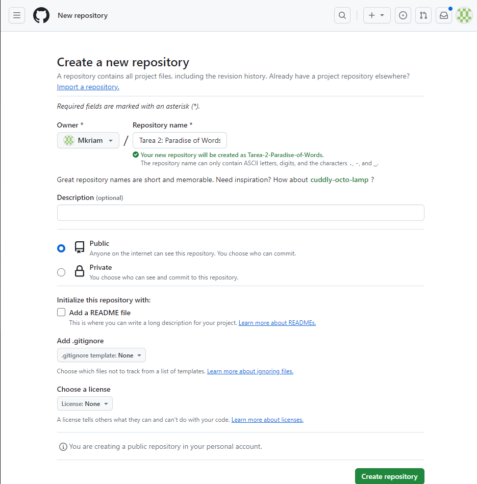
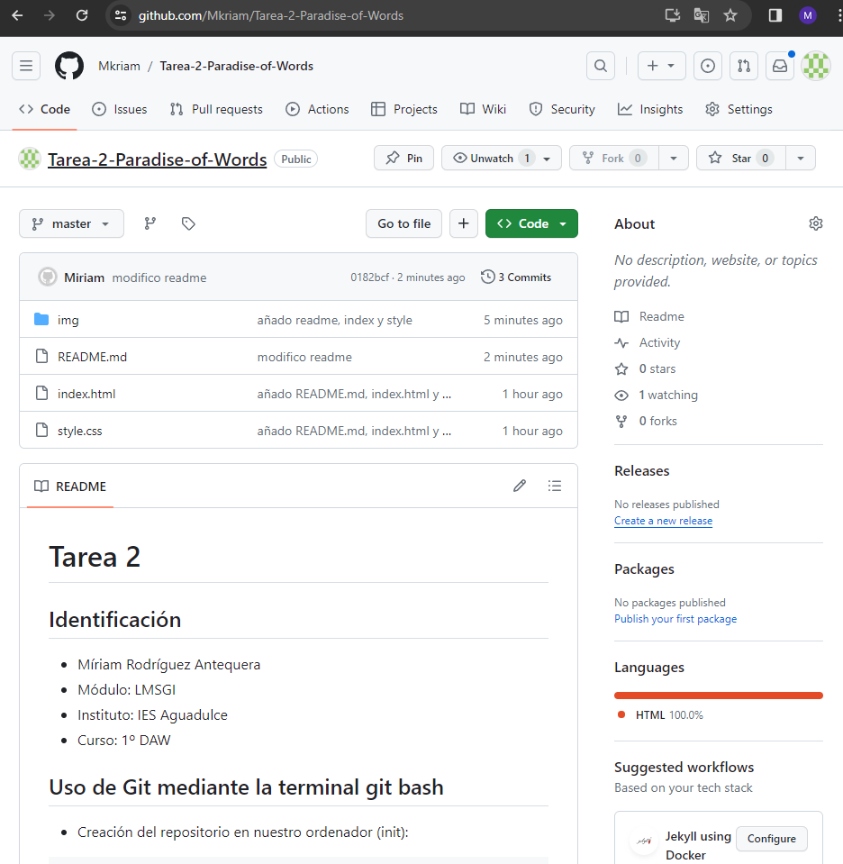
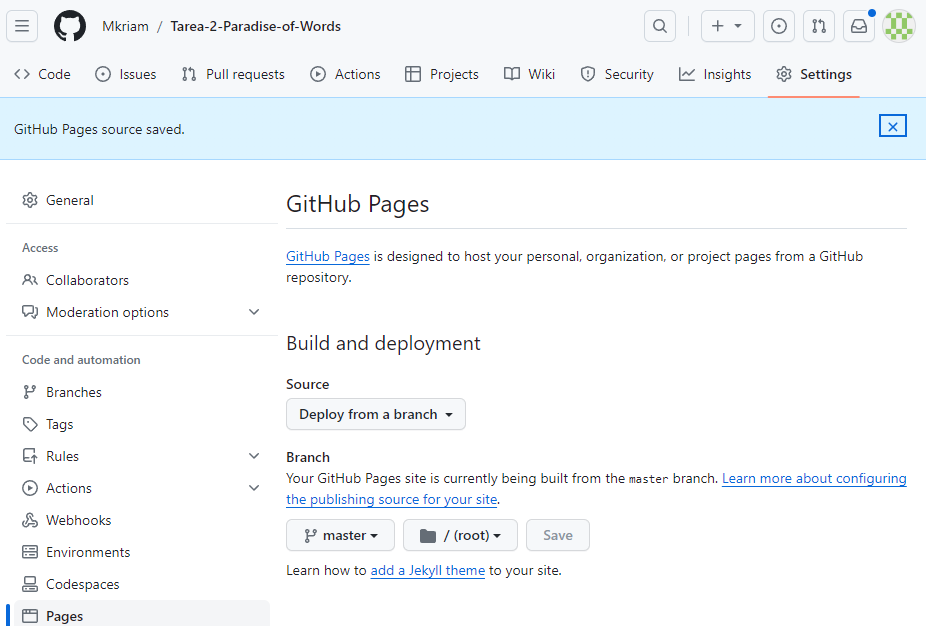
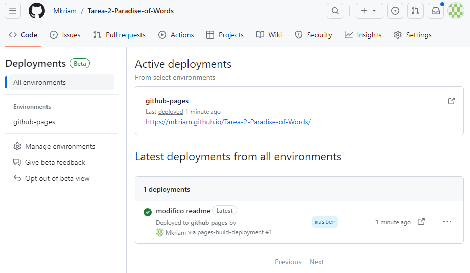
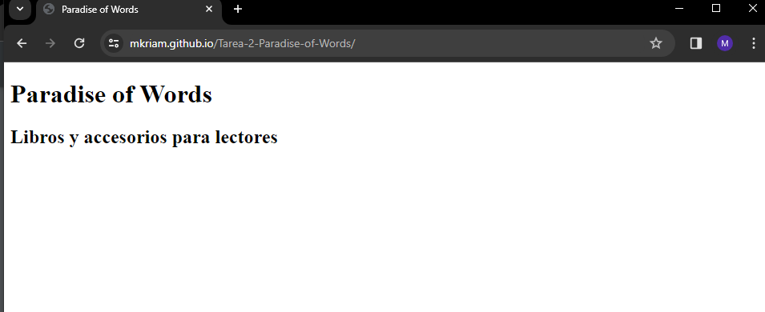
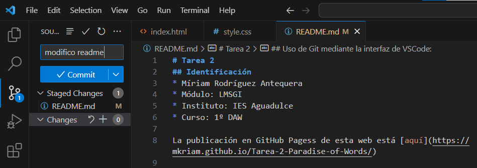
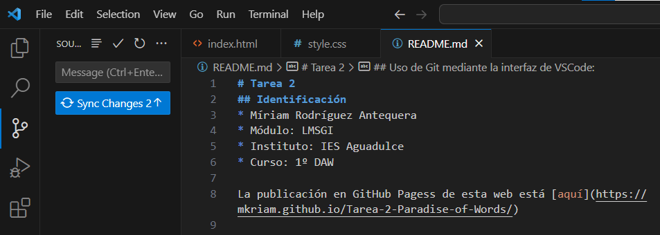
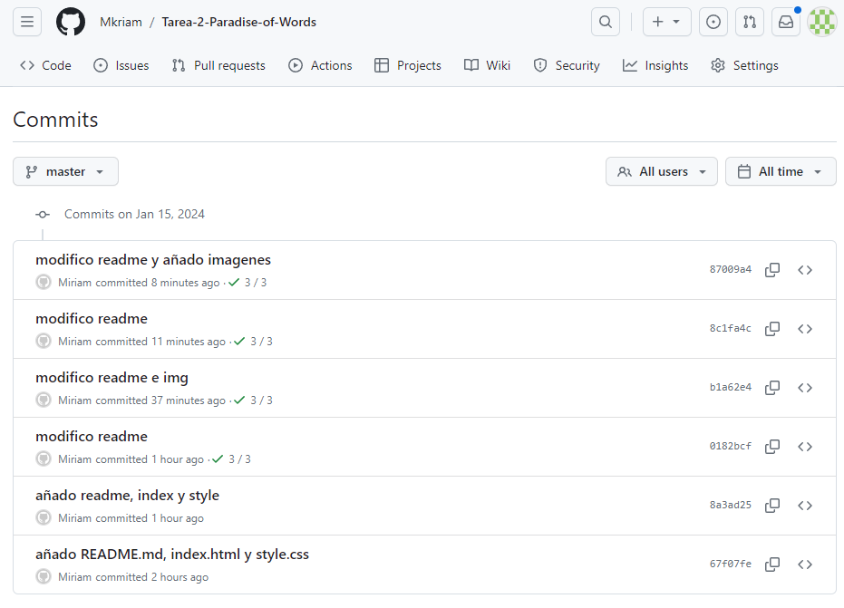

# Tarea 2
## Identificación
* Míriam Rodríguez Antequera
* Módulo: LMSGI
* Instituto: IES Aguadulce
* Curso: 1º DAW

La publicación en GitHub Pagess de esta web está [aquí](https://mkriam.github.io/Tarea-2-Paradise-of-Words/)


## Uso de Git mediante la terminal git bash
* Creación del repositorio en nuestro ordenador (init):
```
maniana@DAMDAW1-XX MINGW64 ~/Dropbox/LM/Tarea2
$ git init
Initialized empty Git repository in C:/Users/maniana/Dropbox/LM/Tarea2/.git/
```
* Creación de un commit inicial (add, status, commit, log):

```
maniana@DAMDAW1-XX MINGW64 ~/Dropbox/LM/Tarea2 (master)
$ git add .

maniana@DAMDAW1-XX MINGW64 ~/Dropbox/LM/Tarea2 (master)
$ git status
On branch master

No commits yet

Changes to be committed:
  (use "git rm --cached <file>..." to unstage)
        new file:   README.md
        new file:   index.html
        new file:   style.css


maniana@DAMDAW1-XX MINGW64 ~/Dropbox/LM/Tarea2 (master)
$ git commit -m "añado README, index y style"
[master (root-commit) cbf91b3] añado README, index y style
 3 files changed, 35 insertions(+)
 create mode 100644 README.md
 create mode 100644 index.html
 create mode 100644 style.css

maniana@DAMDAW1-XX MINGW64 ~/Dropbox/LM/Tarea2 (master)
$ git log
commit cbf91b3ebadcc5480641c2b9954f122f3227a5dd (HEAD -> master)
Author: Miriam <miriam@daw.com>
Date:   Mon Jan 15 08:46:50 2024 +0100

    añado README, index y style

```
* Creación del repositorio en Github:


*  Añade al usuario del profesor: jmoba
como colaborador de ese repositorio:


* Añadir el remoto al repositorio local (branch, remote):
```
maniana@DAMDAW1-XX MINGW64 ~/Dropbox/LM/Tarea2 (master)
$ git branch
* master

maniana@DAMDAW1-XX MINGW64 ~/Dropbox/LM/Tarea2 (master)
$ git remote add origin https://github.com/Mkriam/Tarea-2-Paradise-of-Words.git
```
* Subir el repositorio a Github (push)
```
maniana@DAMDAW1-XX MINGW64 ~/Dropbox/LM/Tarea2 (master)
$ git push origin master
Enumerating objects: 5, done.
Counting objects: 100% (5/5), done.
Delta compression using up to 12 threads
Compressing objects: 100% (3/3), done.
Writing objects: 100% (3/3), 369 bytes | 369.00 KiB/s, done.
Total 3 (delta 1), reused 0 (delta 0), pack-reused 0
remote: Resolving deltas: 100% (1/1), completed with 1 local object.
To https://github.com/Mkriam/Tarea-2-Paradise-of-Words.git
   8a3ad25..0182bcf  master -> master

```
* Comprobar que está subido a Github.



## Publicación en Github Pages:

* Configurar el repositorio para que publique el directorio raíz en Github Pages: 



* Mostrar los despliegues (deployments):



* Mostrar la página web:



* Añadir en el primer apartado, Identificación, el enlace a la publicación del sitio web.

## Uso de Git mediante la interfaz de VSCode:

* Creación de otro commit:



* Subir el repositorio a Github:



* Comprobar que está subido a Github y ver el listado de commit desde Github:



